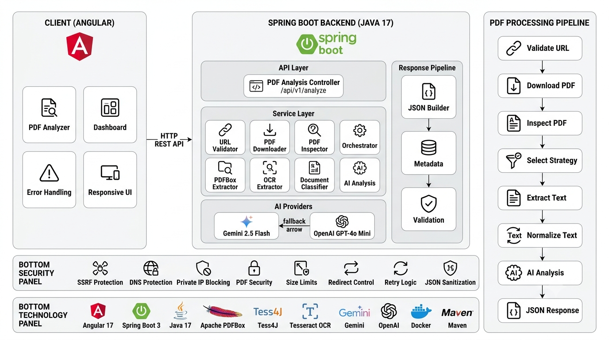

<div align="center">

# PDF Analyzer

**A production-grade document intelligence pipeline with multi-stage extraction, OCR fallback, and dual AI provider support.**

Built with Spring Boot · Angular · Apache PDFBox · Tess4J · Google Gemini · OpenAI GPT

[](./LICENSE)
[](https://openjdk.org/projects/jdk/21/)
[](https://spring.io/projects/spring-boot)
[](https://angular.io/)

### [**Try it live →**](https://pdf-analyzer-frontend-production.up.railway.app)

</div>

---

## Overview

PDF Analyzer is a document ingestion and analysis service that processes real-world PDFs — including scanned files, password-protected documents, multi-column academic papers, and foreign-language content — and returns structured, AI-generated analysis via a clean REST API.

Rather than relying on a single extraction path, the system inspects each document before processing and routes it through the appropriate strategy: native text extraction, OCR, or a hybrid of both. Extracted text is normalized and passed to an AI layer that supports two providers with automatic fallback, structured JSON output, and retry logic.

---

## Live Deployment

| Service | URL |
|---|---|
| Frontend (User Interface) | [pdf-analyzer-frontend-production.up.railway.app](https://pdf-analyzer-frontend-production.up.railway.app) |
| Backend API | [pdf-analyzer-backend-production.up.railway.app](https://pdf-analyzer-backend-production.up.railway.app) |

The frontend is the primary entry point for end users. Paste any publicly accessible PDF URL to receive a structured analysis.

---

## Architecture



### Ingestion Pipeline

```
PDF URL Submitted
      │
      ▼
[1]  URL Validation
     • Scheme whitelist (http/https only)
     • Hostname & private IP blocklist
     • DNS pinning (rebinding protection)
      │
      ▼
[2]  Chunked Download
     • Streaming with hard byte limit
     • Manual redirect control (max 5)
     • %PDF- magic-header validation
      │
      ▼
[3]  PDF Inspection
     • Page count validation
     • Password-protected detection
     • Text density sampling (first 5 pages)
     • Extraction strategy decision
     • Document pre-classification
      │
      ▼
[4]  Extraction Strategy Router
     ├── NATIVE  → PDFBox (setSortByPosition=true)
     ├── OCR     → Tess4J / Tesseract
     └── HYBRID  → Native + OCR supplement
      │
      ▼
[5]  Text Normalization
     • Whitespace normalization
     • Token-budget-aware truncation
     • Document type hint generation
      │
      ▼
[6]  AI Analysis
     ├── Primary  → Google Gemini 2.5 Flash
     └── Fallback → OpenAI GPT-4o Mini
     • Structured JSON output mode
     • Exponential backoff retry
     • Safety-filter detection
     • English output normalization
      │
      ▼
[7]  Response Validation
     • JSON sanitization fallback
     • Field completeness check
     • Pipeline metadata injection
      │
      ▼
Structured JSON → Angular Frontend
```

### Backend Services

| Service | Responsibility |
|---|---|
| `UrlValidator` | SSRF protection, DNS pinning, scheme/IP validation |
| `PdfDownloadService` | Chunked streaming download, redirect control, magic-byte check |
| `PdfInspectionService` | Structural inspection, strategy decision, pre-classification |
| `NativeTextExtractionService` | PDFBox extraction with positional sort for multi-column documents |
| `OcrExtractionService` | Tess4J/Tesseract OCR via page rendering at 200 DPI |
| `PdfExtractionOrchestrator` | Routes NATIVE / OCR / HYBRID based on inspection result |
| `DocumentClassificationService` | Heuristic type classification for AI prompt enrichment |
| `AiAnalysisService` | Prompt building and AI provider delegation |
| `GeminiClient` | Gemini API client with retry, safety detection, and JSON mode |
| `OpenAiClient` | OpenAI API client — fallback when Gemini is unavailable |
| `JsonSanitizer` | Strips markdown fences, extracts clean JSON from AI output |
| `GlobalExceptionHandler` | Centralized typed exception-to-HTTP mapping |

### Frontend Components

| Component / Service | Responsibility |
|---|---|
| `AppComponent` | Root layout and routing |
| `AnalyzerComponent` | PDF URL input, submission, and result display |
| `ResultCardComponent` | Structured output rendering |
| `PdfAnalysisService` | HTTP client to backend API |
| `ErrorDisplayComponent` | User-facing error messages by error type |

---

## AI Provider Configuration

| Provider | Role | Model |
|---|---|---|
| Google Gemini | Primary | `gemini-2.5-flash` |
| OpenAI | Fallback | `gpt-4o-mini` |

Provider selection is controlled by the `AI_PROVIDER` environment variable:

| Value | Behaviour |
|---|---|
| `auto` | Gemini first; falls back to OpenAI automatically |
| `gemini` | Gemini only |
| `openai` | OpenAI only |

Both providers use structured JSON output mode and the same prompt contract, ensuring consistent response shape regardless of which provider handles the request.

---

## API Reference

### `POST /api/analyze`

**Request Body:**
```json
{
  "pdfUrl": "https://arxiv.org/pdf/1706.03762"
}
```

**Success — `200 OK`:**
```json
{
  "documentType": "Research Paper",
  "title": "Attention Is All You Need",
  "authors": "Ashish Vaswani, Noam Shazeer, Niki Parmar, Jakob Uszkoreit, Llion Jones",
  "summary": "The paper introduces the Transformer, a novel sequence-to-sequence architecture built entirely on attention mechanisms. It eliminates recurrence and convolutions, enabling greater training parallelism. The Transformer achieved state-of-the-art results on WMT 2014 English-to-German and English-to-French translation benchmarks.",
  "keyTakeaway": "Self-attention alone is sufficient to capture long-range dependencies in language, replacing recurrent and convolutional layers entirely.",
  "extractionStrategy": "NATIVE",
  "totalPages": 15,
  "qualityScore": "HIGH"
}
```

**Error — `422 Unprocessable Entity`:**
```json
{
  "status": 422,
  "error": "Unprocessable Entity",
  "message": "This PDF is password-protected. Please provide an unlocked version.",
  "timestamp": "2026-06-05T01:54:00.000Z"
}
```

**Response Fields:**

| Field | Description |
|---|---|
| `documentType` | Classified type: Research Paper, Slide Deck, Business Report, Legal Document, etc. |
| `title` | Document title extracted or inferred |
| `authors` | Author names, or `"Not Found"` |
| `summary` | Three or more sentences summarizing the document |
| `keyTakeaway` | The single most important insight from the document |
| `extractionStrategy` | `NATIVE`, `OCR`, or `HYBRID` — the extraction path used |
| `totalPages` | Page count of the processed document |
| `qualityScore` | `HIGH`, `MEDIUM`, or `LOW` — based on extraction confidence |

---

## Edge Cases Handled

| Scenario | Strategy | HTTP Response |
|---|---|---|
| Password-protected PDF | `InvalidPasswordException` caught explicitly | `422 Unprocessable Entity` |
| Non-PDF file disguised as PDF | Magic-header `%PDF-` validation | `422 Unprocessable Entity` |
| SSRF / private IP URL | Blocked before any network call | `422 Unprocessable Entity` |
| DNS rebinding attack | Hostname resolved and re-validated post-lookup | `422 Unprocessable Entity` |
| Oversized PDF (>50 MB) | Hard byte limit enforced during streaming | `422 Unprocessable Entity` |
| Too many pages (>200) | Page-count limit enforced before extraction | `422 Unprocessable Entity` |
| Excessive redirects (>5) | Hard cap on redirect hops | `422 Unprocessable Entity` |
| Unreachable URL | Timeout detection | `502 Bad Gateway` |
| Scanned / image-only PDF | Routed to OCR pipeline via Tess4J | `200 OK` |
| Mixed-content PDF | Hybrid extraction — native + OCR supplement | `200 OK` |
| Two-column academic paper | `setSortByPosition(true)` in PDFBox | `200 OK` |
| Large PDF exceeding token budget | Smart sampling — first 3 + last 2 pages | `200 OK` |
| Foreign-language PDF | Prompt instructs English output; names preserved | `200 OK` |
| Malformed AI JSON response | `JsonSanitizer` strips markdown fences | `200 OK` |
| AI safety block (Gemini) | Detected via `finishReason: SAFETY`; routed to OpenAI | `200 OK` / `422` |
| AI safety block (both providers) | Mapped to clean error message | `422 Unprocessable Entity` |
| AI rate limit / 429 | Exponential backoff: 2s → 4s → 8s | Retried automatically |
| AI auth failure | Fail-fast — no retries | `502 Bad Gateway` |
| Both AI providers unavailable | Typed exception, clean user message | `502 Bad Gateway` |
| OpenAI fallback triggered | Seamless provider switch, same response shape | `200 OK` |

> **Google Drive links:** Use the direct download format `https://drive.google.com/uc?export=download&id=FILE_ID`. Standard sharing links (`/file/d/.../view`) return an HTML page and will be rejected by the magic-byte validator.

---

## Tech Stack

### Backend

| Tool | Version |
|---|---|
| Java (Eclipse Temurin) | OpenJDK 21.0.11 |
| Spring Boot | 3.2.5 |
| Apache PDFBox | 3.0.2 |
| Tess4J (Tesseract LSTM) | 5.11.0 |
| Lombok | 4.0.0 |
| Maven (system) | 3.9.14 |
| Maven Wrapper | 3.9.16 |
| AI — Primary | Google Gemini 2.5 Flash |
| AI — Fallback | OpenAI GPT-4o-mini |

### Frontend

| Tool | Version |
|---|---|
| Angular | 17.3.12 |
| Angular CLI | 17.3.17 |
| Angular Material | 17.3.10 |
| Node.js | 20.20.0 |
| npm | 10.8.2 |
| TypeScript | 5.4.5 |
| RxJS | 7.8.2 |

### DevOps

| Tool | Version |
|---|---|
| Docker | 29.1.3 |
| Docker Compose | 2.40.3 |
| Git | 2.54.0 |
| Hosting | Railway |

---

## Running Locally

### Prerequisites

- Java 21+
- Node.js 20+ and npm
- Angular CLI (`npm install -g @angular/cli`)
- Maven 3.9+
- Tesseract OCR *(required only if `ocr-enabled: true`)*

**Install Tesseract:**

```bash
# Ubuntu / Debian
sudo apt-get install -y tesseract-ocr tesseract-ocr-eng

# macOS
brew install tesseract
```

For Windows, download the installer from the [UB Mannheim releases](https://github.com/UB-Mannheim/tesseract/wiki).

---

### Backend

```bash
cd pdf-analyzer-backend
cp .env.example .env
```

Edit `.env` and configure your API keys:

```env
GEMINI_API_KEY=your_gemini_api_key
GPT_API_KEY=your_openai_api_key
AI_PROVIDER=auto
ALLOWED_ORIGINS=http://localhost:4200
```

Start the server:

```bash
./mvnw spring-boot:run
```

Backend runs on `http://localhost:8080`.

---

### Frontend

```bash
cd pdf-analyzer-frontend
npm install
ng serve
```

Frontend runs on `http://localhost:4200`.

---

### Docker

```bash
docker build -t pdf-analyzer-backend ./pdf-analyzer-backend

docker run -p 8080:8080 \
  -e GEMINI_API_KEY=your_gemini_key \
  -e GPT_API_KEY=your_openai_key \
  -e AI_PROVIDER=auto \
  -e ALLOWED_ORIGINS=http://localhost:4200 \
  pdf-analyzer-backend
```

The Dockerfile uses `eclipse-temurin:21-jre-alpine` as the runtime base and installs Tesseract OCR automatically. Both API keys are injected at runtime and are never baked into the image.

---

## Configuration Reference

Full configuration is managed in `application.yaml` with environment variable overrides:

```yaml
server:
  port: ${PORT:8080}

pdf:
  download:
    connect-timeout-ms: 15000
    read-timeout-ms: 60000
    max-size-bytes: 52428800      # 50 MB
    max-redirects: 5
  processing:
    max-pages: 200
    max-text-chars: 40000
    low-text-threshold: 100
    ocr-enabled: true
  ocr:
    tessdata-path: ${TESSERACT_DATA_PATH:}

ai:
  provider: ${AI_PROVIDER:auto}   # auto | gemini | openai

gemini:
  api:
    key: ${GEMINI_API_KEY:}
    base-url: https://generativelanguage.googleapis.com/v1beta
    model: gemini-2.5-flash
    max-output-tokens: 1024
    temperature: 0.2

openai:
  api:
    key: ${GPT_API_KEY:}
    base-url: https://api.openai.com/v1
    model: gpt-4o-mini
    max-output-tokens: 1024
    temperature: 0.2

cors:
  allowed-origins: ${ALLOWED_ORIGINS:http://localhost:4200}
```

**Environment Variables:**

| Variable | Required | Description |
|---|---|---|
| `GEMINI_API_KEY` | If using Gemini | Google AI Studio API key |
| `GPT_API_KEY` | If using OpenAI | OpenAI platform API key |
| `AI_PROVIDER` | No (default: `auto`) | `auto`, `gemini`, or `openai` |
| `ALLOWED_ORIGINS` | No (default: `http://localhost:4200`) | CORS-allowed frontend origins |
| `TESSERACT_DATA_PATH` | If OCR is enabled | Path to Tesseract `tessdata` directory |
| `PORT` | No (default: `8080`) | Server port |

---

## License

MIT License — see [LICENSE](./LICENSE) for details.
