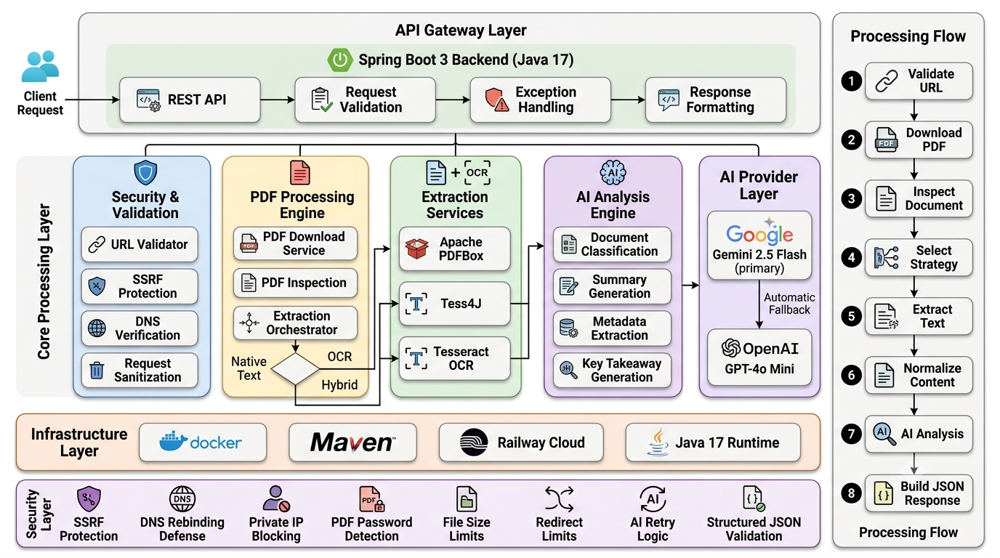

<div align="center">

# PDF Analyzer — Backend

**A production-grade, multi-stage document ingestion and analysis pipeline.**

Built with Spring Boot 3.2 · Apache PDFBox · Tess4J · Google Gemini · OpenAI GPT

[](../LICENSE)
[](https://openjdk.org/projects/jdk/21/)
[](https://spring.io/projects/spring-boot)
[](https://www.docker.com/)

**Live API:** [pdf-analyzer-backend-production.up.railway.app](https://pdf-analyzer-backend-production.up.railway.app)  
**Frontend:** [pdf-analyzer-frontend-production.up.railway.app](https://pdf-analyzer-frontend-production.up.railway.app)

</div>

---

## Overview

Handles scanned PDFs, password-protected documents, multi-column academic papers, foreign-language content, and hostile inputs — with SSRF protection, dual AI provider fallback, structured JSON output, and consistent typed error handling throughout.

Every PDF is routed through a **6-stage ingestion pipeline** rather than a single extraction path. Each stage fails fast with a structured error response and passes a typed result to the next.

---

## Architecture



---

## Pipeline Stages

### Stage 1 — URL Validation

Four independent layers are evaluated before any network call is made. A URL must pass all four or the request is rejected immediately with a `422`.

- **Scheme whitelist** — only `http` and `https` are accepted
- **Hostname blocklist** — blocks `localhost`, `127.0.0.1`, `0.0.0.0`, `169.254.169.254` (AWS EC2 metadata), and `metadata.google.internal` (GCP metadata)
- **RFC 1918 private range check** — blocks `10.x.x.x`, `172.16–31.x.x`, and `192.168.x.x` at the IP level before any DNS resolution
- **DNS pinning** — resolves the hostname and re-validates the resolved IP against the blocklist and private ranges, preventing DNS rebinding attacks where a hostname passes string-level checks but resolves to an internal address at fetch time

### Stage 2 — Safe Download

- Reads in **8 KB chunks** and enforces the 50 MB byte limit inline during streaming — rejects oversized files without loading them into memory
- **Magic-byte check** (`%PDF-` header) inspects the first chunk and rejects files disguised as PDFs before any PDFBox parsing
- **Manual redirect following** with a hard cap of 5 hops — prevents open redirect exploitation and infinite redirect loops

### Stage 3 — PDF Inspection

- Enforces page count limit (max 200 pages) before any extraction begins
- Detects password-protected documents via PDFBox `isEncrypted()` and rejects with a clean user message
- Samples text density across the first 5 pages to inform extraction strategy selection
- Selects one of three strategies — `NATIVE`, `OCR`, or `HYBRID` — based on character density signals
- Performs structural pre-classification (Research Paper, Slide Deck, Legal Document, General) to enrich the downstream AI prompt

### Stage 4 — Extraction

Strategy is determined by Stage 3 and executed by the `PdfExtractionOrchestrator`.

**NATIVE** — `PDFTextStripper` with `setSortByPosition(true)` for layout-aware extraction. Correctly handles multi-column IEEE papers and slide decks without column interleaving artifacts. For documents longer than 5 pages, smart sampling extracts the first 3 pages (title, abstract, introduction) and the last 2 pages (conclusion, references), keeping text within the AI token budget. Documents exceeding the 35,000-character chunk threshold are split into 12,000-character chunks with 500-character overlaps before AI analysis.

**OCR** — `PDFRenderer` renders each page as a `BufferedImage` at 200 DPI using `ImageType.GRAY` (lower memory than RGB). Passed to Tess4J with `OEM_LSTM_ONLY` and `PSM_AUTO`. `image.flush()` is called in a `finally` block after each page to release native graphics memory immediately. Capped at 10 pages per document. Individual page failures are logged and skipped — the pipeline does not abort.

**HYBRID** — Attempts native extraction first. If the character count is above zero but below the quality threshold (100 chars), OCR runs as the dominant path. The higher-quality result is passed to Stage 5.

### Stage 5 — Document Classification

Finalises the document type using extracted text combined with structural signals from Stage 3. The resolved type is injected into the AI prompt as a type-specific context hint, improving output relevance and field accuracy.

### Stage 6 — AI Analysis

- **Primary:** Google Gemini 2.5 Flash — structured JSON output enforced via schema prompt
- **Fallback:** OpenAI GPT-4o-mini — activated automatically on Gemini failure
- Large documents are chunked at 8,000 characters (max 8 chunks) before AI submission
- `JsonSanitizer` strips markdown fences and extracts the first valid `{}` block from AI output before parsing
- Gemini retries use exponential backoff (2s → 4s → 8s) before falling back to OpenAI
- Auth failures (HTTP 401/403) trigger an immediate `502` fail-fast with no retry

```
AiAnalysisService
├── GeminiClient.analyze(text, hint)
│   ├── Success                              → return AnalysisResult
│   ├── Safety block (AiSafetyException)     → retry with OpenAI fallback
│   ├── Rate limit (429, retries exhausted)  → retry with OpenAI fallback
│   ├── Service error (5xx)                  → retry with OpenAI fallback
│   └── Auth failure (401/403)               → immediate 502, no fallback
│
└── OpenAiClient.analyze(text, hint)  [fallback]
    ├── Success                              → return AnalysisResult
    ├── Rate limit (429, retries exhausted)  → 502
    └── Auth failure (401)                   → immediate 502, no retry
```

Both providers receive the same prompt and produce an identical `AnalysisResult` — the calling layer is unaware of which provider responded.

---

## Tech Stack

| Layer | Technology | Version |
|---|---|---|
| Language | Java (Eclipse Temurin) | OpenJDK 21.0.11 |
| Framework | Spring Boot | 3.2.5 |
| PDF Native Extraction | Apache PDFBox | 3.0.2 |
| OCR Engine | Tess4J (Tesseract LSTM) | 5.11.0 |
| AI — Primary | Google Gemini | 2.5 Flash |
| AI — Fallback | OpenAI GPT | 4o-mini |
| JSON | Jackson | Bundled with Spring |
| Boilerplate | Lombok | 4.0.0 |
| Build | Maven (wrapper) | 3.9.16 |
| Containerization | Docker | 29.1.3 |
| Deployment | Railway | — |

---

## API Reference

### `POST /api/analyze`

**Request Body:**
```json
{
  "pdfUrl": "https://arxiv.org/pdf/1706.03762"
}
```

**Success — `200 OK`:**
```json
{
  "documentType": "Research Paper",
  "title": "Attention Is All You Need",
  "authors": "Ashish Vaswani, Noam Shazeer, Niki Parmar, Jakob Uszkoreit, Llion Jones, Aidan N. Gomez, Łukasz Kaiser, Illia Polosukhin",
  "summary": "The paper introduces the Transformer, a novel architecture for sequence transduction that relies entirely on attention mechanisms. This approach eliminates the need for recurrence and convolutions, allowing for greater parallelization and efficiency in training. The Transformer demonstrated superior performance on machine translation tasks, achieving state-of-the-art results on WMT 2014 benchmarks.",
  "keyTakeaway": "Self-attention replaces recurrence and convolutions entirely, enabling parallelization and state-of-the-art translation benchmarks.",
  "extractionStrategy": "NATIVE",
  "totalPages": 15,
  "qualityScore": "HIGH"
}
```

**Error Responses:**

| Status | Scenario | Message |
|---|---|---|
| `400` | Blank or missing `pdfUrl` | `pdfUrl: must not be blank` |
| `422` | Invalid or blocked URL | `Access to private IP address ranges is not permitted.` |
| `422` | DNS rebinding attempt | `Access to resolved IP address is not permitted.` |
| `422` | Password-protected PDF | `This PDF is password-protected. Please provide an unlocked version.` |
| `422` | Not a PDF file | `The URL returned a web page or plain text, not a PDF.` |
| `422` | PDF exceeds 50 MB | `PDF exceeds the maximum allowed size of 50 MB.` |
| `422` | PDF exceeds 200 pages | `PDF exceeds the maximum allowed page count of 200.` |
| `422` | Too many redirects | `Too many redirects (max 5).` |
| `422` | AI safety block (both providers) | `This document could not be analyzed due to AI safety policy restrictions.` |
| `502` | PDF host unreachable | `Failed to download PDF. HTTP status: 404` |
| `502` | Both AI providers unavailable | `AI service is temporarily unavailable. Please retry.` |

**Response Schema:**

```typescript
{
  documentType:       string;   // "Research Paper" | "Slide Deck / Presentation" | "Legal Document" | "General Document"
  title:              string;
  authors:            string;
  summary:            string;   // Minimum 3 sentences
  keyTakeaway:        string;
  extractionStrategy: string;   // "NATIVE" | "OCR" | "HYBRID"
  totalPages:         number;
  qualityScore:       string;   // "HIGH" | "MEDIUM" | "LOW"
}
```

---

## Edge Cases Handled

| Scenario | Detection Point | Behaviour |
|---|---|---|
| Password-protected PDF | `PdfInspectionService` — `isEncrypted()` | `422` — actionable user message |
| SSRF / private IP | `UrlValidator` Stage 1 | `422` — blocked before any network call |
| DNS rebinding attack | `UrlValidator` DNS pinning | `422` — resolved IP re-validated after DNS lookup |
| Non-PDF / disguised file | `PdfDownloadService` magic-byte check | `422` — rejected in first 8 KB chunk |
| Oversized PDF (>50 MB) | `PdfDownloadService` inline stream check | `422` — rejected during download, not after full load |
| Too many redirects (>5) | `PdfDownloadService` manual redirect handler | `422` — redirect loop protection |
| PDF exceeds 200 pages | `PdfInspectionService` page count check | `422` — enforced before extraction begins |
| Scanned / image-only PDF | `PdfExtractionOrchestrator` → OCR | Full Tess4J LSTM pipeline |
| Low-density native text | `PdfExtractionOrchestrator` → HYBRID | Native first, OCR dominant if below threshold |
| Multi-column layout (IEEE) | `NativeTextExtractionService` | `setSortByPosition(true)` prevents column interleaving |
| Large PDF (>5 pages) | `NativeTextExtractionService` | Smart sampling: first 3 + last 2 pages |
| Text exceeding chunk threshold | `AiAnalysisService` chunking | Split into 8,000-char chunks, max 8 chunks |
| OCR page-level failure | `OcrExtractionService` per-page catch | Page skipped, pipeline continues |
| OCR memory spike | `OcrExtractionService` | `ImageType.GRAY` + `image.flush()` in finally block |
| Gemini safety block | `GeminiClient` → `AiAnalysisService` | Retried against OpenAI fallback transparently |
| Both providers safety block | `AiAnalysisService` | `422` — clean user-facing message |
| Malformed AI JSON | `JsonSanitizer` | Strips markdown fences, extracts first `{}` block |
| Gemini rate limit (429) | `GeminiClient` retry loop | Exponential backoff 2s → 4s → 8s, then OpenAI fallback |
| OpenAI rate limit (429) | `OpenAiClient` retry loop | Exponential backoff 2s → 4s → 8s, then `502` |
| Auth failure (401/403) | Either client | Immediate `502` fail-fast — no retry |
| Both providers unavailable | `AiAnalysisService` | `502` — service unavailable message |
| Foreign-language PDF | AI prompt rule | All output fields normalised to English |
| Google Drive share link | Magic-byte validator | `422` — use `/uc?export=download&id=FILE_ID` format |

> **Google Drive:** Standard sharing links (`/file/d/.../view`) return an HTML confirmation page and are correctly rejected by the magic-byte validator. Use the direct download format: `https://drive.google.com/uc?export=download&id=FILE_ID`

---

## Running Locally

### Prerequisites

- Java 21+
- Maven 3.9+
- Tesseract OCR with `eng` language data
- A Gemini API key — [aistudio.google.com](https://aistudio.google.com/app/apikeys)
- An OpenAI API key *(optional — used as fallback only)*

### Install Tesseract

```bash
# Ubuntu / Debian
sudo apt-get install -y tesseract-ocr tesseract-ocr-eng

# macOS
brew install tesseract
```

For Windows, download from [UB Mannheim Tesseract releases](https://github.com/UB-Mannheim/tesseract/wiki) and add to PATH.

Verify:
```bash
tesseract --version
```

### Configure Environment Variables

```bash
# Linux / macOS
export GEMINI_API_KEY=your_gemini_api_key
export GPT_API_KEY=your_openai_api_key      # optional
export AI_PROVIDER=auto                      # auto | gemini | openai
```

```powershell
# Windows PowerShell
$env:GEMINI_API_KEY = "your_gemini_api_key"
$env:GPT_API_KEY    = "your_openai_api_key"
$env:AI_PROVIDER    = "auto"
```

### Start the Server

```bash
cd pdf-analyzer-backend
./mvnw spring-boot:run
```

Server starts on `http://localhost:8080`. Confirm in the logs:

```
OCR available — tessdata path: /usr/share/tessdata
AI provider mode: AUTO
Started PdfAnalyzerApplication in 4.3 seconds
```

### Docker

```bash
docker build -t pdf-analyzer-backend .

docker run -p 8080:8080 \
  -e GEMINI_API_KEY=your_gemini_key \
  -e GPT_API_KEY=your_openai_key \
  -e AI_PROVIDER=auto \
  pdf-analyzer-backend
```

The Dockerfile uses `eclipse-temurin:21-jre-alpine` as the runtime base and installs Tesseract via `apk`. API keys are injected at runtime and never baked into the image.

### Quick Test with curl

```bash
curl -X POST http://localhost:8080/api/analyze \
  -H "Content-Type: application/json" \
  -d '{"pdfUrl":"https://arxiv.org/pdf/1706.03762"}'
```

**Error path tests:**

| Test | `pdfUrl` | Expected |
|---|---|---|
| SSRF block | `http://10.0.0.1/secret` | `422` — private IP range |
| Non-PDF | `https://www.google.com` | `422` — magic-byte rejection |
| Password PDF | `https://sample-files.com/downloads/documents/pdf/protected.pdf` | `422` — password protected |
| Missing field | `{}` (empty body) | `400` — must not be blank |
| OCR pipeline | `https://solutions.weblite.ca/pdfocrx/scansmpl.pdf` | `200` — OCR strategy, MEDIUM quality |

---

## Configuration Reference

`src/main/resources/application.yaml`:

```yaml
# ── Server ───────────────────────────────────────────────────
server:
  port: ${PORT:8080}
  servlet:
    context-path: /

# ── Spring ───────────────────────────────────────────────────
spring:
  config:
    import: optional:dotenv:.env
  application:
    name: pdf-analyzer-backend
  jackson:
    default-property-inclusion: non_null
    serialization:
      write-dates-as-timestamps: false
  task:
    execution:
      pool:
        core-size: 4
        max-size: 8
        queue-capacity: 50
      thread-name-prefix: analysis-

# ── Actuator ─────────────────────────────────────────────────
management:
  endpoints:
    web:
      exposure:
        include: health,info
  endpoint:
    health:
      show-details: never

# ── PDF Download ──────────────────────────────────────────────
pdf:
  download:
    connect-timeout-ms: 15000
    read-timeout-ms: 60000
    max-size-bytes: 52428800      # 50 MB
    max-redirects: 5
  processing:
    max-pages: 200
    max-text-chars: 40000
    low-text-threshold: 100
    ocr-enabled: true
    chunk-threshold-chars: 35000
    chunk-size-chars: 12000
    chunk-overlap-chars: 500
  ocr:
    tessdata-path: ${TESSERACT_DATA_PATH:}
    max-pages: 10

# ── AI Provider ───────────────────────────────────────────────
ai:
  provider: ${AI_PROVIDER:auto}   # auto | gemini | openai
  analysis:
    chunk-threshold-chars: 12000
    chunk-size-chars: 8000
    max-chunks: 8

# ── Gemini ────────────────────────────────────────────────────
gemini:
  api:
    key: ${GEMINI_API_KEY:}
    base-url: https://generativelanguage.googleapis.com/v1beta
    model: gemini-2.5-flash
    max-output-tokens: 1024
    temperature: 0.2

# ── OpenAI (fallback) ─────────────────────────────────────────
openai:
  api:
    key: ${GPT_API_KEY:}
    base-url: https://api.openai.com/v1
    model: gpt-4o-mini
    max-output-tokens: 1024
    temperature: 0.2

# ── CORS ──────────────────────────────────────────────────────
cors:
  allowed-origins: ${ALLOWED_ORIGINS:http://localhost:4200}

# ── Logging ───────────────────────────────────────────────────
logging:
  level:
    com.pdfanalyzer: INFO
    org.springframework.web: WARN
  pattern:
    console: "%d{yyyy-MM-dd HH:mm:ss} [%thread] %-5level %logger{36} - %msg%n"
```

**Environment Variables:**

| Variable | Required | Description |
|---|---|---|
| `GEMINI_API_KEY` | If using Gemini | Google AI Studio API key |
| `GPT_API_KEY` | If using OpenAI | OpenAI platform API key |
| `AI_PROVIDER` | No (default: `auto`) | `auto`, `gemini`, or `openai` |
| `ALLOWED_ORIGINS` | No (default: `http://localhost:4200`) | CORS-allowed frontend origins |
| `TESSERACT_DATA_PATH` | If OCR is enabled | Path to Tesseract `tessdata` directory |
| `PORT` | No (default: `8080`) | Server port |

---

## Deployment

Deployed on Railway at [pdf-analyzer-backend-production.up.railway.app](https://pdf-analyzer-backend-production.up.railway.app).

**Railway environment variables:**

```
GEMINI_API_KEY=your_gemini_key
GPT_API_KEY=your_openai_key
AI_PROVIDER=auto
ALLOWED_ORIGINS=https://pdf-analyzer-frontend-production.up.railway.app
TESSERACT_DATA_PATH=/usr/share/tessdata
JAVA_TOOL_OPTIONS=-XX:+UseContainerSupport -XX:MaxRAMPercentage=70.0 -XX:InitialRAMPercentage=40.0 -XX:+UseG1GC -Djava.awt.headless=true -XX:+ExitOnOutOfMemoryError
PORT=8080
```

`JAVA_TOOL_OPTIONS` is set as a Railway variable rather than in the Dockerfile so JVM memory flags apply to every deploy without requiring a rebuild.

---

## Test Results

All tests verified against the live deployment.

| Test | Document | Strategy | Result |
|---|---|---|---|
| Password-protected PDF | `http://sample-files.com protected.pdf` | — | `422` — `PdfPasswordException` |
| SSRF / private IP | `http://10.0.0.1/internal` | — | `422` — RFC 1918 blocked at Stage 1 |
| Non-PDF URL | `https://www.google.com` | — | `422` — magic-byte rejection |
| Scanned PDF | `https://solutions.weblite.ca/pdfocrx/scansmpl.pdf` | OCR | `200` — Tess4J pipeline, MEDIUM quality |
| Scanned PDF | `https://19january2021snapshot.epa.gov/sites/static/files/2016-02/documents/epa_sample_letter_sent_to_commissioners_dated_february_29_2015.pdf` | OCR | `200` — Tess4J pipeline, MEDIUM quality |
| Codex paper (35 pages) | `https://arxiv.org/pdf/2107.03374` | NATIVE | `200` — smart sampling, within token budget |
| Attention Is All You Need (15 pages) | `https://arxiv.org/pdf/1706.03762` | NATIVE | `200` — correct title, authors, summary |
| GPT-3 paper (75 pages) | `https://arxiv.org/pdf/2005.14165` | NATIVE | `200` — no OOM, smart sampling |
| Two-column IEEE layout | `https://arxiv.org/pdf/1512.03385` | NATIVE | `200` — no column interleaving |
| Foreign-language PDF | `https://arxiv.org/pdf/2106.01534` | NATIVE | `200` — all fields in English |
| Google Drive direct link | `https://drive.google.com/uc?export=download&id=19GGhHwVx-q3NgbEUMbKqCHJgPvA7OzcU` | NATIVE | `200` — full pipeline |
| Archive.org historical doc | `https://archive.org/download/httpswww.ijtsrd.commanagementaccounting-and-finance45154a-study-on-financial-sta/223%20A%20Study%20on%20financial%20statement%20analysis%20of%20Ultratech%20Cement%20limited.pdf` | NATIVE | `200` — CDN redirect chain followed |

---

## License

MIT License — see [LICENSE](../LICENSE) for details.
